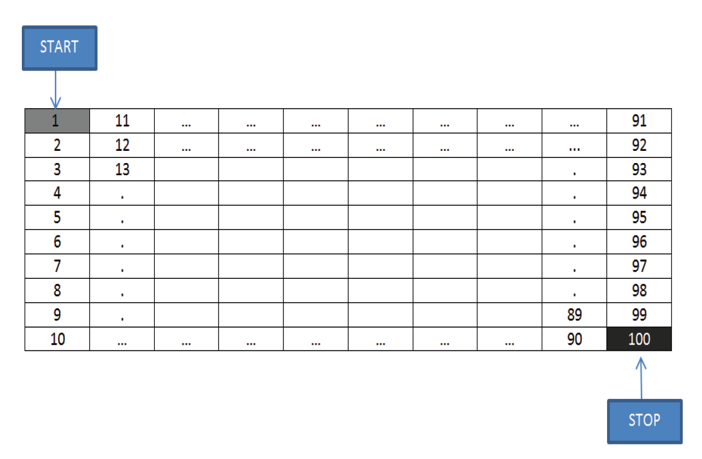
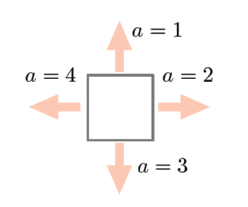
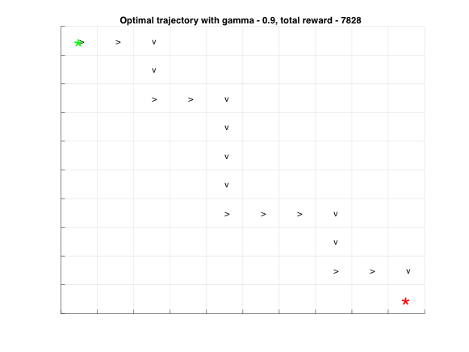

# Q-LEARNING FOR WORLD GRID NAVIGATION

This project is for implementation of Q-Learning algorithm for world grid navigation. Matlab has been used for the implementation.

## Problem Statement

Suppose that a robot is to traverse on a 10 x 10 grid, with the start state being the top-left cell and the goal state being the bottom-right cell, as is illustrated in Figure 1.

<table>
  <tr>
    <td>
      
    </td>
  </tr>
  <tr>
    <td>
      <strong>Fig. 1. Illustration of a 10 x 10 world grid with start state and goal state. The index of each cell follows the MATLAB column-wise convention.</strong>
    </td>
  </tr>
</table>

The robot is to reach the goal state by maximizing the total reward of the trip. Note that the numbers (from 1 to 100) assigned to the individual cells represent the states; they do not represent the reward for the cells. At a state, the robot can take one of four actions (as shown in Figure 2) to move up (a = 1), right (a = 2), down (a = 3), or left (a = 4), into the corresponding adjacent state deterministically.

<table>
  <tr>
    <td>
      
    </td>
  </tr>
  <tr>
    <td>
      <strong>Fig. 2. Possible actions of the robot at a given state.</strong>
    </td>
  </tr>
</table>

The learning process will consist of a series of trials. In a trial the robot starts at the initial state (s = 1) and makes transitions, according to the algorithm for Q-learning with ϵ-greedy exploration, until it reaches the goal state (s = 100), upon which the trial ends. The above process repeats until the values of the Q-function converge to the optimal values. An optimal policy can be then obtained.

## Implementation

### Task 1

Write a MATLAB (M-file) program to implement the Q-learning algorithm, using the reward function as given in task1.mat and with the ϵ-greedy exploration algorithm by setting ϵk, k and as specified in Table 1.
The file task1.mat is included in the zip file that also contains this document. It can be directly loaded into MATLAB and contains the matrix variable reward (dimension: 1004), in which each column corresponds to an action and each row to a state. For example, the reward for taking action a = 3 at state s = 1 to enter state s = 2 is given by the (1; 3) entry of reward, i.e., p(1; 3; 2) = reward(1; 3). Transitions that are not possible are marked by a reward of -1.

#### Table 1

<table>
  <thead>
    <tr>
      <th scope="row" rowspan="2">ϵk, 𝛼k</th>
      <th scope="col" colspan="2">Training accuracy</th>
      <th scope="col" colspan="2">Test accuracy</th>
    </tr>
    <tr>
      <th>𝛾 = 0.5</th>
      <th>𝛾 = 0.9</th>
      <th>𝛾 = 0.5</th>
      <th>𝛾 = 0.9</th>
    </tr>
  </thead>
  <tbody>
    <tr>
      <td>1 / 𝑘</td>
      <td>0</td>
      <td>0</td>
      <td>-</td>
      <td>-</td>
    </tr>
    <tr>
      <td>100 / (100 + 𝑘)</td>
      <td>0</td>
      <td>10</td>
      <td>-</td>
      <td>1.1368</td>
    </tr>
    <tr>
      <td>(1 + log(𝑘)) / 𝑘</td>
      <td>0</td>
      <td>0</td>
      <td>-</td>
      <td>-</td>
    </tr>
    <tr>
      <td>(1 + 5log(𝑘)) / 𝑘</td>
      <td>0</td>
      <td>10</td>
      <td>-</td>
      <td>3.4976</td>
    </tr>
  </tbody>
</table>

The plot below shows the trajectory and reward.

<table>
  <tr>
    <td>
      
    </td>
  </tr>
  <tr>
    <td>
      <strong>Fig. 3. Trajectory and reward.</strong>
    </td>
  </tr>
</table>

### Task 2

Write a MATLAB (M-file) program to implement Q-learning using your own values of the relevant parameters. Assume that the grid size is 10 x 10 and implement your program in a MATLAB M-file. This M-file will be used to find the optimal policy using a reward function not provided to the students, as part of the assessment scheme discussed in Section V.

#### Solution –

For this task following design parameters are chosen for optimality –

   1. discount is 0.9 as I found in task 1 that value of 0.9 yields 100% successful runs.
   2. alpha is selected as constant 1.
   3. epsilon is selected - 100 / (100 + 𝑘)

RL_main.m file can be executed to run the main program with unknown reward. The output is generated in a column vector named qevalstates.

An assumption is made that the variable qevalreward already exists in Matlab workspace. If the variable is not found, the script will exit. The code was implemented and run in Matlab version - R2016b (9.1.0.441655).
